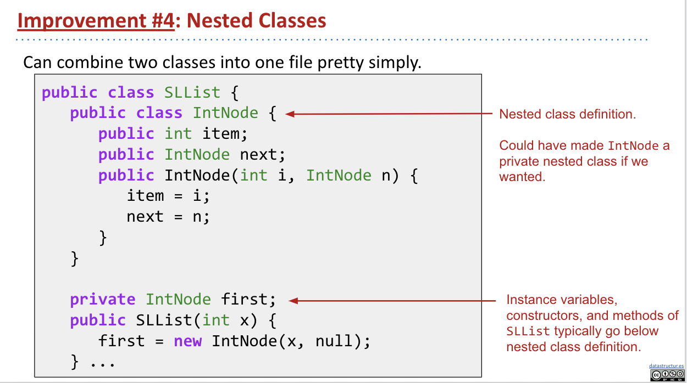
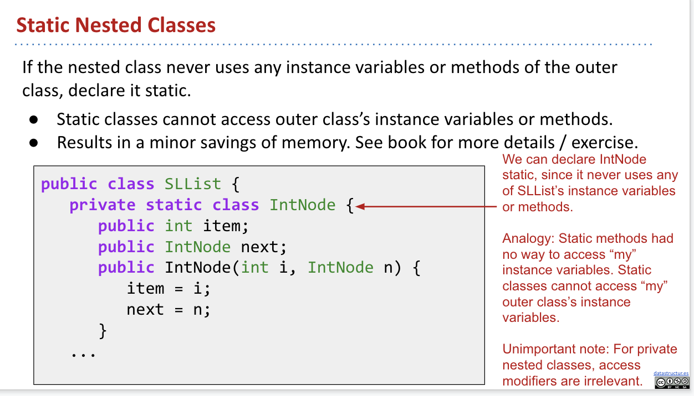
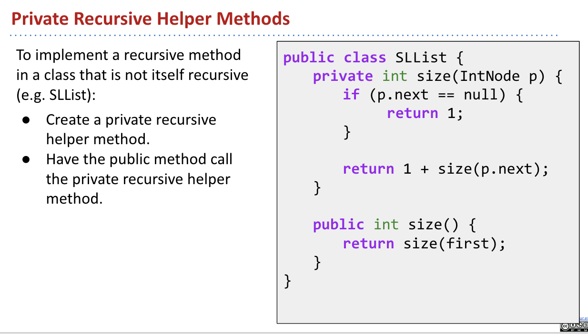
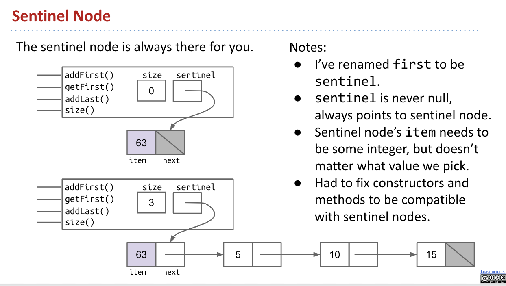

## 05.SLLists, Nested Classes, Sentinel Nodes

### Nested Classes

#### Why Nested Classes?

Nested Classes are useful when a class doesn’t stand on its own and is obviously subordinate to another class.

- Make the nested class private if other classes should never use the nested class.

